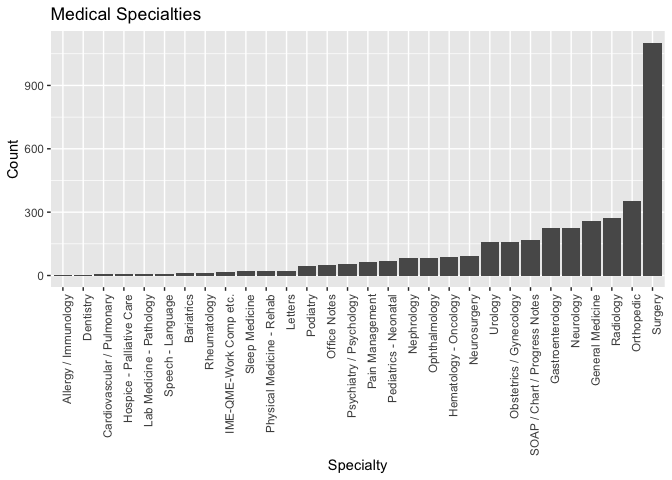
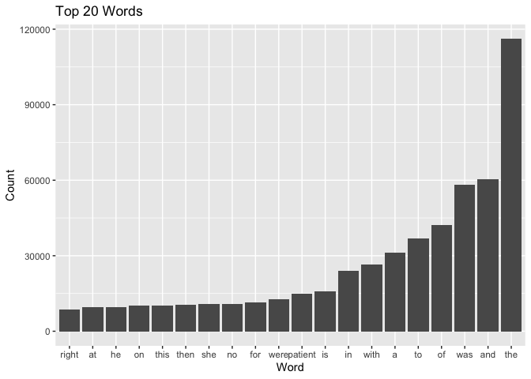
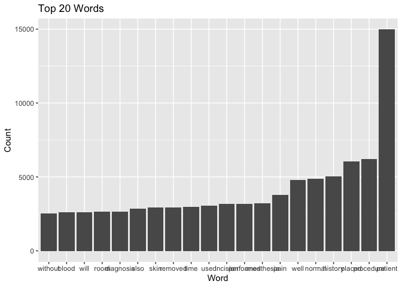
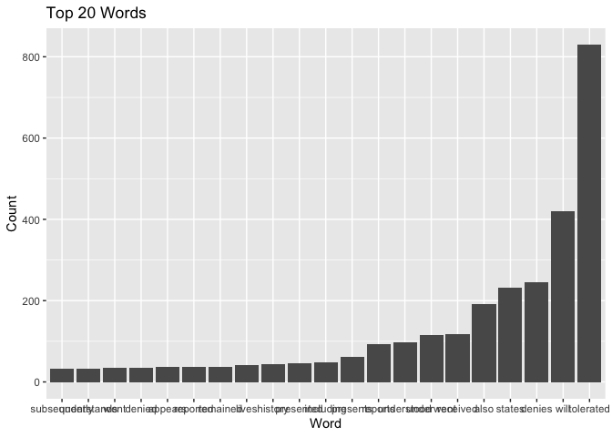
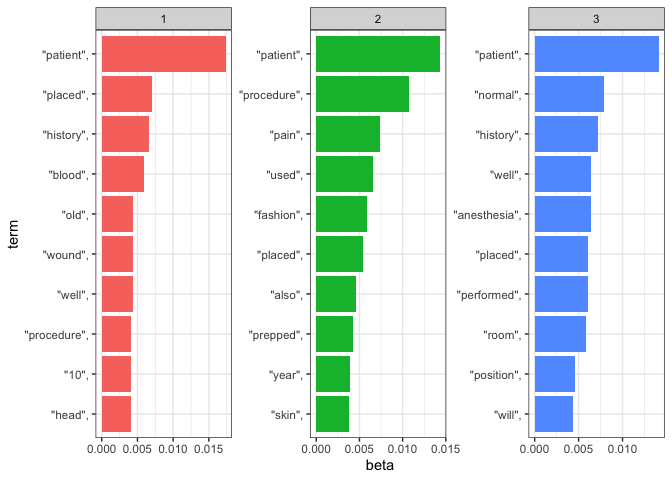
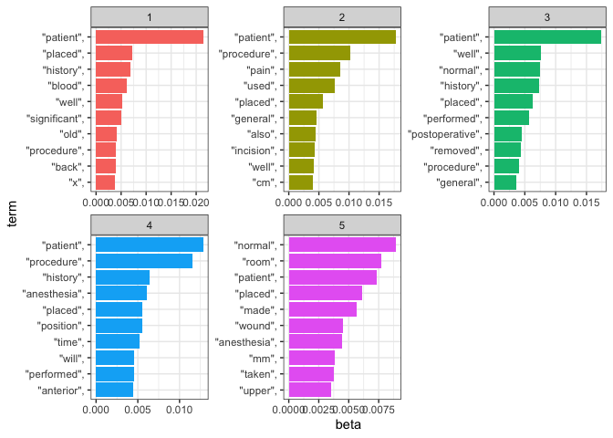
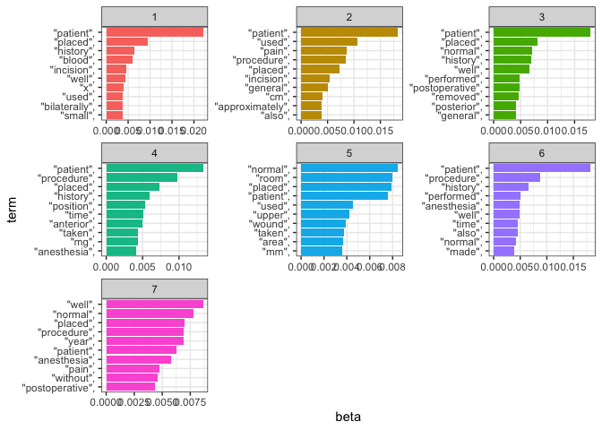

Lab 08 - Text Mining/NLP
================

# Learning goals

- Use `unnest_tokens()` and `unnest_ngrams()` to extract tokens and
  ngrams from text
- Use dplyr and ggplot2 to analyze and visualize text data
- Try a theme model using `topicmodels`

# Lab description

For this lab we will be working with the medical record transcriptions
from <https://www.mtsamples.com/> available at
<https://github.com/JSC370/JSC370-2025/tree/main/data/medical_transcriptions>.

# Deliverables

1.  Questions 1-7 answered, knit to pdf or html output uploaded to
    Quercus.

2.  Render the Rmarkdown document using `github_document` and add it to
    your github site. Add link to github site in your html.

3.  [Github](https://github.com/e1444/JSC370-labs)

### Setup packages

You should load in `tidyverse`, (or `data.table`), `tidytext`,
`wordcloud2`, `tm`, and `topicmodels`.

## Read in the Medical Transcriptions

Loading in reference transcription samples from
<https://www.mtsamples.com/>

``` r
library(tidytext)
library(tidyverse)
library(wordcloud2)
library(tm)
library(topicmodels)

mt_samples <- read_csv("https://raw.githubusercontent.com/JSC370/JSC370-2025/main/data/medical_transcriptions/mtsamples.csv")
mt_samples <- mt_samples |>
  select(description, medical_specialty, transcription)

head(mt_samples)
```

    ## # A tibble: 6 × 3
    ##   description                                    medical_specialty transcription
    ##   <chr>                                          <chr>             <chr>        
    ## 1 A 23-year-old white female presents with comp… Allergy / Immuno… "SUBJECTIVE:…
    ## 2 Consult for laparoscopic gastric bypass.       Bariatrics        "PAST MEDICA…
    ## 3 Consult for laparoscopic gastric bypass.       Bariatrics        "HISTORY OF …
    ## 4 2-D M-Mode. Doppler.                           Cardiovascular /… "2-D M-MODE:…
    ## 5 2-D Echocardiogram                             Cardiovascular /… "1.  The lef…
    ## 6 Morbid obesity.  Laparoscopic antecolic anteg… Bariatrics        "PREOPERATIV…

------------------------------------------------------------------------

## Question 1: What specialties do we have?

We can use `count()` from `dplyr` to figure out how many different
medical specialties are in the data. Are these categories related?
overlapping? evenly distributed? Make a bar plot.

``` r
mt_samples |>
  count(medical_specialty) |>
  ggplot(aes(x = reorder(medical_specialty, n), y = n)) +
  geom_col() +
  theme(axis.text.x = element_text(angle = 90, hjust = 1)) + 
  labs(x = "Specialty", y = "Count", title = "Medical Specialties")
```

<!-- -->

The data is not evenly distributed, with surgery being the most
representative specialty by a wide margin, making up nearly a third of
th data. There are 30 categories in total, most of which are medical,
but some miscellaneous categories are also present such as “Office
Notes”.

------------------------------------------------------------------------

## Question 2: Tokenize

- Tokenize the the words in the `transcription` column
- Count the number of times each token appears
- Visualize the top 20 most frequent words with a bar plot
- Create a word cloud of the top 20 most frequent words

### Explain what we see from this result. Does it makes sense? What insights (if any) do we get?

``` r
tokens <- mt_samples |>
  select(transcription) |>
  unnest_tokens(word, transcription) |>
  count(word, sort = TRUE)

tokens |>
  slice_max(n, n = 20) |>
  ggplot(aes(x = reorder(word, n), y = n)) +
  geom_bar(stat = "identity") +
  labs(x = "Word", y = "Count", title = "Top 20 Words")
```

<!-- -->

``` r
wordcloud2(tokens |> slice_max(n, n = 20))
```

<div class="wordcloud2 html-widget html-fill-item" id="htmlwidget-b9c6be17a991e739fb2b" style="width:672px;height:480px;"></div>
<script type="application/json" data-for="htmlwidget-b9c6be17a991e739fb2b">{"x":{"word":["the","and","was","of","to","a","with","in","is","patient","were","for","no","she","then","this","on","he","at","right"],"freq":[116095,60381,58047,42147,36842,31122,26462,23955,15842,14971,12712,11444,10835,10713,10563,10307,10105,9717,9677,8540],"fontFamily":"Segoe UI","fontWeight":"bold","color":"random-dark","minSize":0,"weightFactor":0.001550454369266549,"backgroundColor":"white","gridSize":0,"minRotation":-0.7853981633974483,"maxRotation":0.7853981633974483,"shuffle":true,"rotateRatio":0.4,"shape":"circle","ellipticity":0.65,"figBase64":null,"hover":null},"evals":[],"jsHooks":{"render":[{"code":"function(el,x){\n                        console.log(123);\n                        if(!iii){\n                          window.location.reload();\n                          iii = False;\n\n                        }\n  }","data":null}]}}</script>

We do not gain any meaningful insights from the word cloud, as the most
frequent words are articles, prepositions, and other common words that
do not provide any information about the content of our data.

------------------------------------------------------------------------

## Question 3: Stopwords

- Redo Question 2 but remove stopwords
- Check `stopwords()` library and `stop_words` in `tidytext`
- Use regex to remove numbers as well
- Try customizing your stopwords list to include 3-4 additional words
  that do not appear informative

### What do we see when you remove stopwords and then when you filter further? Does it give us a better idea of what the text is about?

``` r
head(stopwords("english"))
```

    ## [1] "i"      "me"     "my"     "myself" "we"     "our"

``` r
length(stopwords("english"))
```

    ## [1] 174

``` r
head(stop_words)
```

    ## # A tibble: 6 × 2
    ##   word      lexicon
    ##   <chr>     <chr>  
    ## 1 a         SMART  
    ## 2 a's       SMART  
    ## 3 able      SMART  
    ## 4 about     SMART  
    ## 5 above     SMART  
    ## 6 according SMART

``` r
tokens <- mt_samples |>
  select(transcription) |>
  unnest_tokens(word, transcription) |>
  count(word, sort = TRUE) |>
  filter(!word %in% stopwords("english")) |>
  filter(!word %in% c("left", "right", "using", "noted")) |>
  filter(!str_detect(word, "\\d+"))

tokens |>
  slice_max(n, n = 20) |>
  ggplot(aes(x = reorder(word, n), y = n)) +
  geom_bar(stat = "identity") +
  labs(x = "Word", y = "Count", title = "Top 20 Words")
```

<!-- -->

``` r
wordcloud2(tokens |> slice_max(n, n = 20))
```

<div class="wordcloud2 html-widget html-fill-item" id="htmlwidget-50fc0c7902e8b7541b53" style="width:672px;height:480px;"></div>
<script type="application/json" data-for="htmlwidget-50fc0c7902e8b7541b53">{"x":{"word":["patient","procedure","placed","history","normal","well","pain","anesthesia","performed","incision","used","time","removed","skin","also","diagnosis","room","blood","will","without"],"freq":[14971,6214,6052,5044,4862,4787,3798,3200,3180,3166,3036,2979,2948,2928,2850,2665,2654,2602,2602,2539],"fontFamily":"Segoe UI","fontWeight":"bold","color":"random-dark","minSize":0,"weightFactor":0.01202324494021775,"backgroundColor":"white","gridSize":0,"minRotation":-0.7853981633974483,"maxRotation":0.7853981633974483,"shuffle":true,"rotateRatio":0.4,"shape":"circle","ellipticity":0.65,"figBase64":null,"hover":null},"evals":[],"jsHooks":{"render":[{"code":"function(el,x){\n                        console.log(123);\n                        if(!iii){\n                          window.location.reload();\n                          iii = False;\n\n                        }\n  }","data":null}]}}</script>

We see some other non-informative words as well as numbers, which we
manually filter out. We are left with patient as the most frequent word,
which makes sense in the context of our data.

------------------------------------------------------------------------

## Question 4: ngrams

Repeat question 2, but this time tokenize into bi-grams. How does the
result change if you look at tri-grams? Note we need to remove stopwords
a little differently. You don’t need to recreate the wordclouds.

``` r
stopwords2 <- c(stopwords("english"), "left", "right", "using", "noted", as.character(0:9))

sw_start <- paste0("^", paste(stopwords2, collapse=" |^"), "$")
sw_end <- paste0("", paste(stopwords2, collapse="$| "), "$")

tokens_bigram <- mt_samples |>
  select(transcription) |>
  unnest_tokens(ngram, transcription, token = "ngrams", n = 2) |>
  filter(!str_detect(ngram, sw_start)) |>  # Remove stopwords at the beginning
  filter(!str_detect(ngram, sw_end)) |>    # Remove stopwords at the end
  count(ngram, sort = TRUE)

head(tokens_bigram)
```

    ## # A tibble: 6 × 2
    ##   ngram                       n
    ##   <chr>                   <int>
    ## 1 year old                 1915
    ## 2 operating room           1333
    ## 3 preoperative diagnosis   1053
    ## 4 postoperative diagnosis   974
    ## 5 procedure well            863
    ## 6 blood loss                838

``` r
tokens_trigram <- mt_samples |>
  select(transcription) |>
  unnest_tokens(ngram, transcription, token = "ngrams", n = 3) |>
  filter(!str_detect(ngram, sw_start)) |>  # Remove stopwords at the beginning
  filter(!str_detect(ngram, sw_end)) |>    # Remove stopwords at the end
  count(ngram, sort = TRUE)

head(tokens_trigram)
```

    ## # A tibble: 6 × 2
    ##   ngram                       n
    ##   <chr>                   <int>
    ## 1 prepped and draped       1309
    ## 2 incision was made         896
    ## 3 tolerated the procedure   891
    ## 4 procedure the patient     838
    ## 5 patient was taken         666
    ## 6 estimated blood loss      657

We observe more informative ngrams. “year old” is the most frequent
bigram, and “prepped and draped” is the most frequent trigram. These
ngrams provide more information about the content of our data than the
single words.

------------------------------------------------------------------------

## Question 5: Examining words

Using the results from the bigram, pick a word and count the words that
appear before and after it, and create a plot of the top 20.

``` r
library(stringr)
# e.g. patient, blood, preoperative...
# choose "patient"
tokens_bigram2 <- tokens_bigram |>
  filter(str_detect(ngram, "patient .*|.* patient")) |>
    mutate(word = str_remove(ngram, "patient"),
           word = str_remove_all(word, " "))

tokens_bigram2 |>
  slice_max(n, n = 20) |>
  ggplot(aes(x = reorder(word, n), y = n)) +
  geom_bar(stat = "identity") +
  labs(x = "Word", y = "Count", title = "Top 20 Words")
```

<!-- -->

``` r
wordcloud2(tokens_bigram2 |> slice_max(n, n = 20) |> select(word, n))
```

<div class="wordcloud2 html-widget html-fill-item" id="htmlwidget-ec89ec884a34d2491a49" style="width:672px;height:480px;"></div>
<script type="application/json" data-for="htmlwidget-ec89ec884a34d2491a49">{"x":{"word":["tolerated","will","denies","states","also","received","underwent","understood","reports","presents","including","presented","history","lives","remained","appears","reported","denied","went","subsequently","understands"],"freq":[829,420,246,231,192,118,116,98,93,61,48,47,43,42,38,36,36,35,34,33,33],"fontFamily":"Segoe UI","fontWeight":"bold","color":"random-dark","minSize":0,"weightFactor":0.2171290711700844,"backgroundColor":"white","gridSize":0,"minRotation":-0.7853981633974483,"maxRotation":0.7853981633974483,"shuffle":true,"rotateRatio":0.4,"shape":"circle","ellipticity":0.65,"figBase64":null,"hover":null},"evals":[],"jsHooks":{"render":[{"code":"function(el,x){\n                        console.log(123);\n                        if(!iii){\n                          window.location.reload();\n                          iii = False;\n\n                        }\n  }","data":null}]}}</script>

------------------------------------------------------------------------

## Question 6: Words by Specialties

Which words are most used in each of the specialties? You can use
`group_by()` and `top_n()` from `dplyr` to have the calculations be done
within each specialty. Remember to remove stopwords. How about the 5
most used words?

``` r
mt_samples |>
  unnest_tokens(word, transcription) |>
  filter(!word %in% stopwords2) |>
  group_by(medical_specialty) |>
  count(word, sort = TRUE) |>
  top_n(1)
```

    ## Selecting by n

    ## # A tibble: 32 × 3
    ## # Groups:   medical_specialty [30]
    ##    medical_specialty             word        n
    ##    <chr>                         <chr>   <int>
    ##  1 Surgery                       patient  4855
    ##  2 Orthopedic                    patient  1711
    ##  3 General Medicine              patient  1356
    ##  4 Gastroenterology              patient   835
    ##  5 Urology                       patient   776
    ##  6 Neurology                     patient   648
    ##  7 Radiology                     normal    644
    ##  8 Obstetrics / Gynecology       patient   628
    ##  9 SOAP / Chart / Progress Notes patient   537
    ## 10 Psychiatry / Psychology       patient   532
    ## # ℹ 22 more rows

Amongst the top 10, 9 of the categories have “patient” as the most
frequent word, with the exception being radiology, where “normal” is the
most frequent.

``` r
mt_samples |>
  unnest_tokens(word, transcription) |>
  filter(!word %in% stopwords2) |>
  group_by(medical_specialty) |>
  count(word, sort = TRUE) |>
  top_n(5)
```

    ## Selecting by n

    ## # A tibble: 177 × 3
    ## # Groups:   medical_specialty [30]
    ##    medical_specialty word           n
    ##    <chr>             <chr>      <int>
    ##  1 Surgery           patient     4855
    ##  2 Surgery           procedure   3243
    ##  3 Surgery           placed      3025
    ##  4 Orthopedic        patient     1711
    ##  5 Surgery           anesthesia  1687
    ##  6 Surgery           well        1645
    ##  7 General Medicine  patient     1356
    ##  8 General Medicine  history     1027
    ##  9 Orthopedic        placed       924
    ## 10 Gastroenterology  patient      835
    ## # ℹ 167 more rows

In the top 5, we see more variation in the most frequent words.

## Question 7: Topic Models

See if there are any themes in the data by using a topic model (LDA).

- you first need to create a document term matrix
- then you can try the LDA function in `topicmodels`. Try different k
  values.
- create a facet plot of the results from the LDA (see code from
  lecture)

``` r
run_lda <- function(k) {
  transcripts_dtm <- mt_samples |>
    select(transcription) |>
    unnest_tokens(word, transcription) |>
    filter(!word %in% stopwords2) |>
    DocumentTermMatrix()

  transcripts_dtm <- as.matrix(transcripts_dtm)

  transcripts_lda <- LDA(transcripts_dtm, k = k, control = list(seed = 1234))

  top_terms <- 
    tidy(transcripts_lda, matrix = "beta") |>
    group_by(topic) |>
    slice_max(beta, n = 10) |> 
    ungroup() |>
    arrange(topic, -beta)

  top_terms |>
    mutate(term = reorder_within(term, beta, topic)) %>%
    ggplot(aes(beta, term, fill = factor(topic))) +
    geom_col(show.legend = FALSE) +
    facet_wrap(~ topic, scales = "free") +
    theme_bw()+
    scale_y_reordered()
}
```

``` r
run_lda(3)
```

<!-- -->

``` r
run_lda(5)
```

<!-- -->

``` r
run_lda(7)
```

<!-- -->
